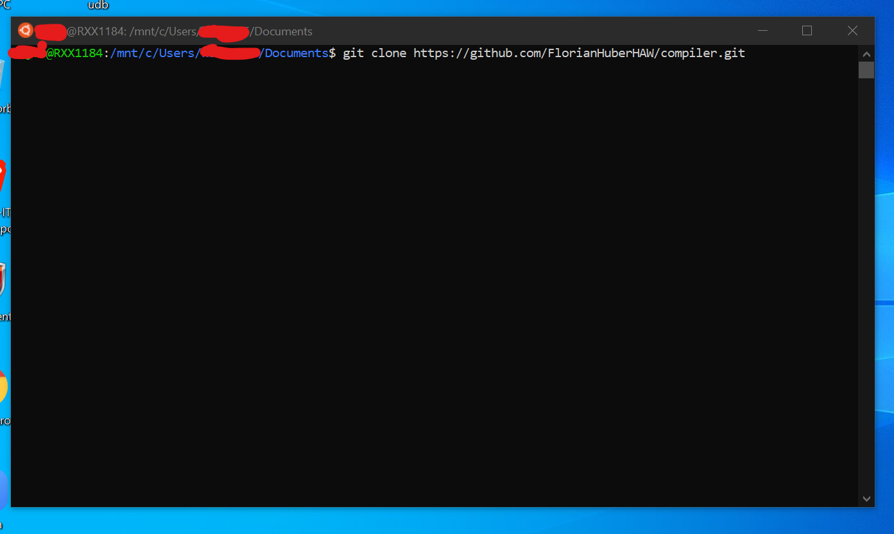
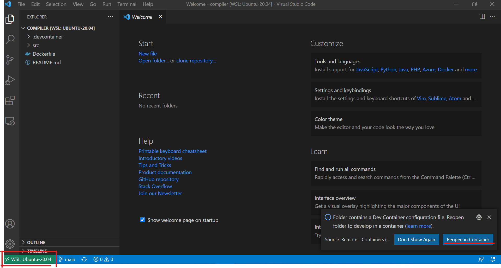

# Compiler 2021-SS

## Install

### 1 Step:
[Install docker](https://docs.docker.com/get-docker/)

### 2 Step:
[Install VSCode](https://code.visualstudio.com/download)

### 3 Step:
Install the VSCode extension: Remote Development


### 4 Step:
Open a terminal and copy the repo.

```console
git clone https://github.com/FlorianHuberHAW/compiler.git
```


### 5 Step:
Open the project with vscode
```console
cd compiler
code .
```
### 6 Step:
Accept the option to Reopen in Container or set it manually in the left bottom corner.



## Progamming

### Run P2
```console
make P2 test_file=test.sim
```

## Ref:
https://code.visualstudio.com/docs/containers/choosing-dev-environment
